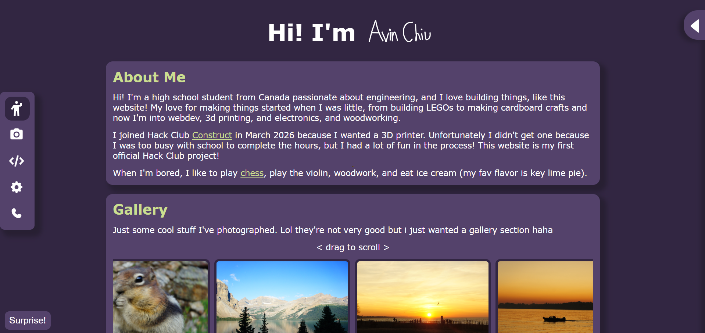
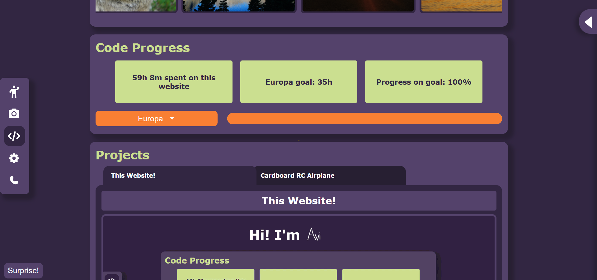
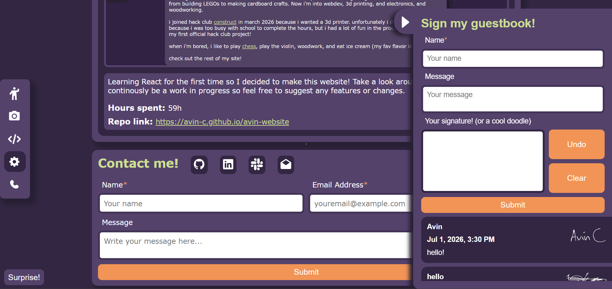

# My personal website
This is my personal website, a corner of the internet where I will be putting all my stuff! It's primarily just a fun project that I used to learn React, so it is not a professional website by any means.

 My website can be seen on the web, accessed through the domain [avin-c.github.io/avin-website](https://avin-c.github.io/avin-website/), deployed through Github Pages.  

## What my website is:
As I have mentioned earlier, my project is just a fun project that I made to learn React and will be my personal site that people can go to to view some of my work. 
This website contains several sections/features... 
- **About me**, a short description of me and what I do
- **Gallery**, a couple photographs I have taken over the years
- **Code Progress**, a little widget displaying my progress on YSWS goals linked to my hackatime API
- **Projects**, a portfolio section showcasing my past work (hopefully it will get larger soon)
- **Contact me** a section with links to my socials and a built in form for sending emails to me
- **Guestbook sidebar**, this was a pretty cool part of website because it contains a signature section along with a name and a message. And this guestbook is located off to the side, expanding on hover. 
- **Navbar**, 
- **Surprise button**, click for a surprise from Shrek!

## Where it can be used:

My website is mainly designed for use on Chromium-based browsers but it works on Firefox and Firefox-based browsers. It can be accessed on: [https://avin-c.github.io/avin-website](https://avin-c.github.io/avin-website/).

## What I made it with 

My website is built on a React + Vite framework. It uses Supabase as the database for the guestbook. Formspree was used for the automatic email sending for the contact me form. Additionally, I used [motion](https://www.npmjs.com/package/perfect-freehand) to animate my home page title signature and [perfect-freehand](https://www.npmjs.com/package/perfect-freehand) to create the signature component in my guestbook. 

## Why I made it

I wanted to make a personal website I have browsed through so many other personal websites and pagerings, and was so inspired by the cool websites that other people made. I had always wanted to get into making websites and thought that this would be such a great oppurtunity to learn a web dev framework so I decided to learn React through this project.

 In addition, this project is for #Horizons so that is another reason I decided to build this project. 

## Screenshots

