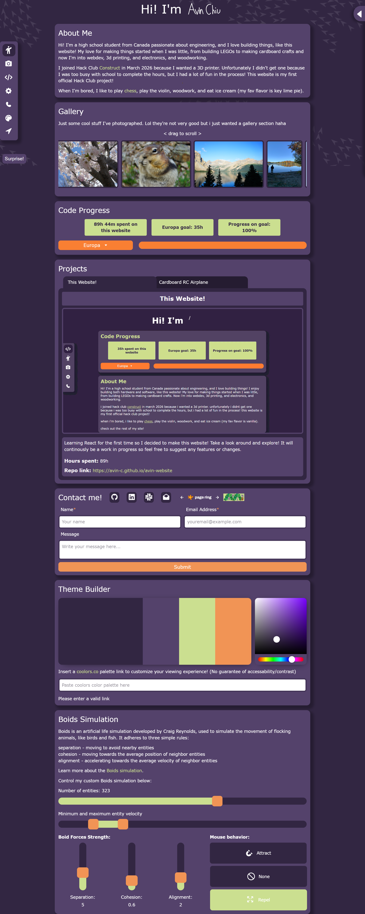

# My personal website
This is my personal website, a corner of the internet where I will be putting all my stuff! It's primarily just a fun project that I used to learn React, so it is not a professional website by any means. This project is for #horizons.

 My website can be seen on the web, accessed through the domain [avin-c.github.io/avin-website](https://avin-c.github.io/avin-website/), deployed through Github Pages.  

## What my website is:
As I have mentioned earlier, my project is just a fun project that I made to learn React and will be my personal site that people can go to to view some of my work. 
This website contains several sections/features... 
- **About me**, a short description of me and what I do
- **Gallery**, a couple photographs I have taken over the years
- **Code Progress**, a little widget displaying my progress on YSWS goals linked to my hackatime API
- **Projects**, a portfolio section showcasing my past work (hopefully it will get larger soon)
- **Contact me** a section with links to my socials and a built in form for sending emails to me
- **Guestbook sidebar**, this was a pretty cool part of website because it contains a signature section along with a name and a message. And this guestbook is located off to the side, expanding on hover. 
- **Navbar**, 
- **Surprise button**, click for a surprise from Shrek!
- **Theme Builder**, a tool that that changes the theme given manual color selection and coolors.co link pasting. I designed it so that I could personally change the theme myself in the future easily if I wanted to. Also helpful for people if they perfer a lighter theme.
- **Boids Simulation** I learned about this a while ago and thought it would be the perfect touch to my website's background. It displays a boids simulation background that can be interacted with through the mouse, and several settings like speed, count, or mouse behavior can be adjusted with the boids simulation control panel section in my website. 

## Where it can be used:

My website is mainly designed for use on Chromium-based browsers but it works on Firefox and Firefox-based browsers. It can be accessed on: [https://avin-c.github.io/avin-website](https://avin-c.github.io/avin-website/). 

## What I made it with 

My website is built on a React + Vite framework. It uses Supabase as the database for the guestbook. Formspree was used for the automatic email sending for the contact me form. Additionally, I used [motion](https://www.npmjs.com/package/perfect-freehand) to animate my home page title signature and [perfect-freehand](https://www.npmjs.com/package/perfect-freehand) to create the signature component in my guestbook. Additionally, [react-beautiful-color](https://www.npmjs.com/package/react-beautiful-color) was used for the theme builder color picker, and two Radix primitives, [toggle group](https://www.radix-ui.com/primitives/docs/components/toggle-group) and [slider](https://www.radix-ui.com/primitives/docs/components/slider), were used to control the boids simulation. [PixiJS](https://pixijs.com/) was used for animating the boids simulation smoothly. 

## Why I made it

I wanted to make a personal website I have browsed through so many other personal websites and pagerings, and was so inspired by the cool websites that other people made. I had always wanted to get into making websites and thought that this would be such a great oppurtunity to learn a web dev framework so I decided to learn React through this project. 

 In addition, this project is for #Horizons so that is another reason I decided to build this project. 

## Screenshots

## AI Use

AI was used for help developing the draggable infinite gallery section, parts of the navbar, connecting to the Hackatime API, connecting the database to the guestbook form, initializing the Pixi.js in the boids simulation component, and applying library components to my code. I also used AI for debugging advice. 

## License
MIT License